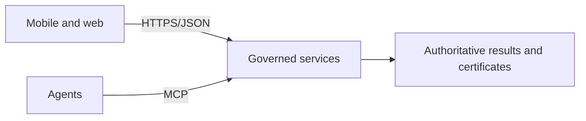

# API Boundary

## Rule

Mobile and web clients use a conventional versioned HTTPS/JSON API. AI agents may separately use MCP (Model Context Protocol — not relevant to the mobile client). Every interface talks to the same Floodcaster services; there is no separate backend for mobile, and only those services decide flood results.

The mobile client does not directly call Rust, Python, PostGIS, model storage, or certificate internals.

## POC contract

[contracts/floodcaster-mobile.openapi.yaml](contracts/floodcaster-mobile.openapi.yaml) defines the draft test surface:

- `GET /mobile/v1/bootstrap` (a "read model" below means a read-only JSON view served by the API)
- `GET /mobile/v1/properties/{property_id}`
- `GET /mobile/v1/determinations/{determination_id}`
- `GET /mobile/v1/certificates/{certificate_id}`
- `POST /mobile/v1/operations`

The files in `contracts/` are `POC_CONTRACT_DRAFT`, not ratified production contracts. Synthetic fixtures are labeled `TEST_ONLY`. Unknown production semantics are listed in [KNOWN-GAPS.md](KNOWN-GAPS.md).

## Write semantics

The mobile client submits an operation containing a user-attested observation and a stable client-generated operation ID. The server response separates:

- transport acknowledgement;
- replay detection;
- domain outcome (`APPLIED`, `VERIFY_REQUIRED`, or `REJECTED`); and
- any later issued determination/certificate references.

The client never resolves a conflict by declaring its local value authoritative. A successful HTTP response does not itself mean a determination was issued.

## Mock behavior

The local mock supports named scenarios through `X-Floodcaster-Mock-Scenario`: `applied`, `verify-required`, `rejected`, `replay`, and `collision`. This header is mock-only and must not be implemented as a production feature.
