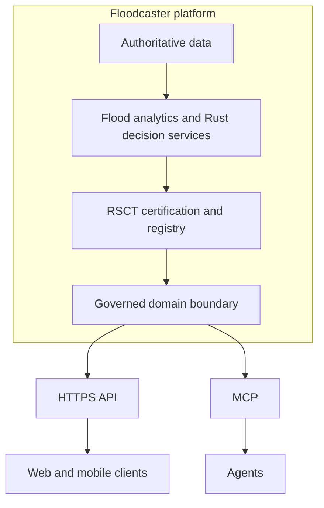
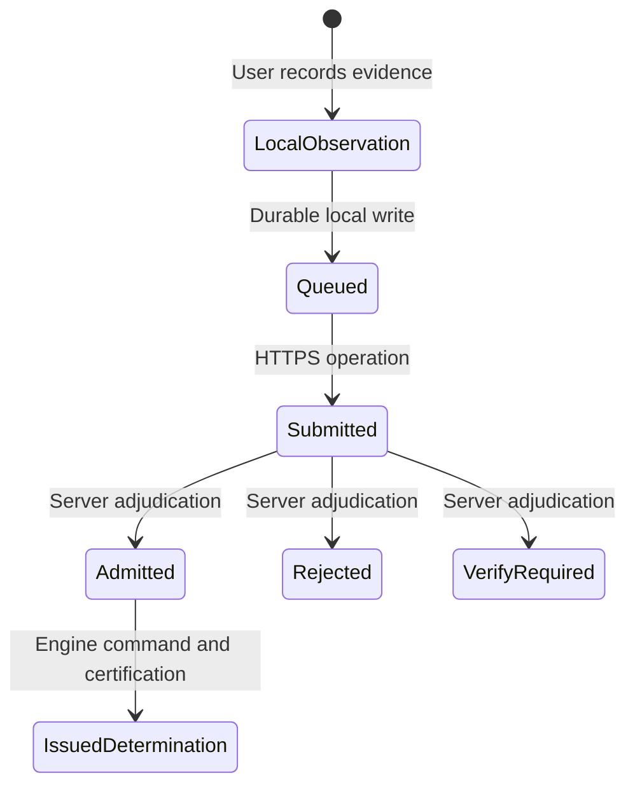

# Architecture

Floodcaster is the product authority. Mobile is one client experience.

## Artifact lifecycle

`IssuedDetermination` is not a client transition. It is a server-owned outcome returned as a distinct artifact.

## Repository roles

| Area | Role |
| --- | --- |
| Root React/Leaflet SPA | Existing client reference and reuse evidence |
| `contracts/` | Draft client-facing POC interface |
| `fixtures/` | Synthetic scenarios for comparable tests |
| `mock-server/` | Local simulator for the draft contract |
| `map-pack/` | Test-only offline-pack handoff format |
| `docs/infosec/` | Existing security review pack; unchanged |

Framework selection is downstream of these boundaries. A contractor may recommend Capacitor, React Native, Flutter, a PWA, or another approach, but the recommendation must satisfy the same contract and acceptance tests.
