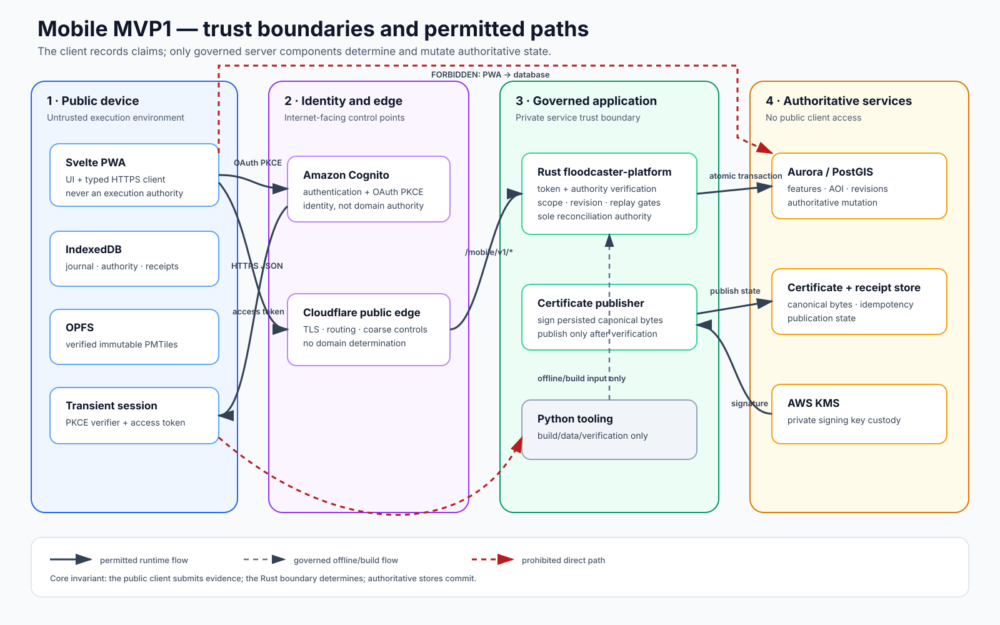
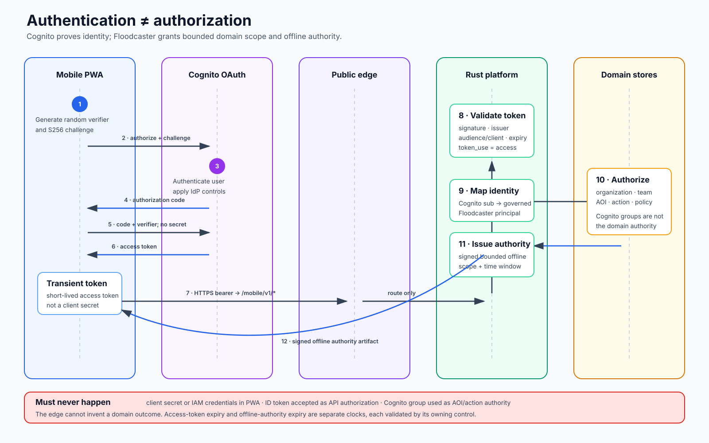
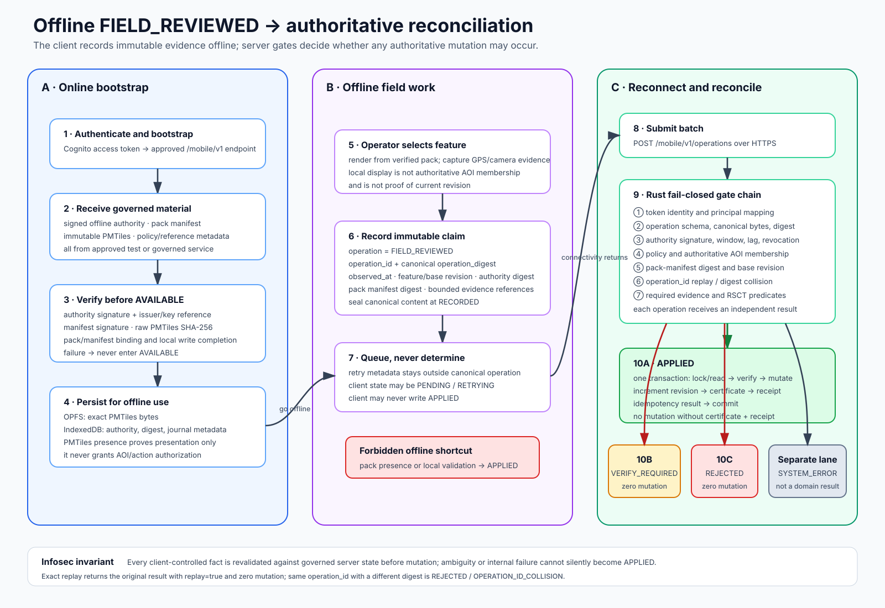
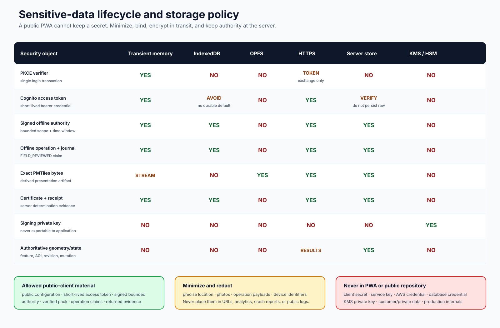
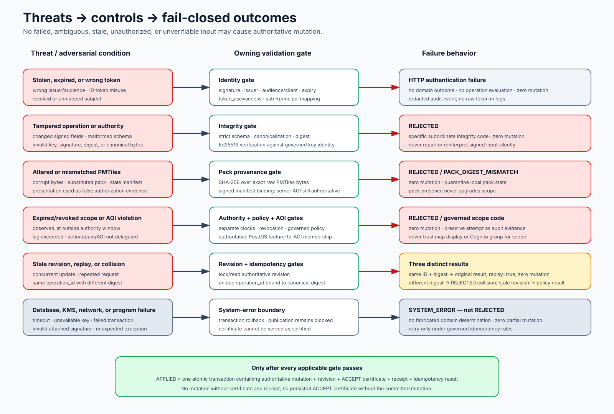

# Mobile Infosec Flow Pack

These diagrams describe the intended Mobile MVP1 security boundary. They are briefing artifacts for threat modeling and architecture review; they do not replace approved API, schema, cryptographic, or infrastructure contracts.

## Implementation status

- The public repository contains the existing React/Leaflet SPA as assessment evidence.
- The SPA currently demonstrates the HTTPS client boundary; it does **not** implement the complete Cognito, offline-authority, OPFS, journal, or Rust reconciliation flows shown here.
- Diagrams 2–5 are target security requirements for the proposed Svelte PWA and must be verified against code, deployed configuration, and approved contracts before an Infosec sign-off.
- Any unresolved `/mobile/v1/*` wire detail remains a question. The pictures do not authorize an implementer to invent it.

## Diagram set

| # | Diagram | Primary review question |
|---|---|---|
| 1 | [Trust boundaries](01-mobile-trust-boundaries.svg) | Where does trust change, and which direct paths are forbidden? |
| 2 | [Authentication and authorization](02-authentication-authorization.svg) | How are Cognito identity and Floodcaster domain authority kept separate? |
| 3 | [Offline operation and reconciliation](03-offline-reconciliation.svg) | How can offline work reconcile without letting the client declare success? |
| 4 | [Sensitive-data lifecycle](04-sensitive-data-lifecycle.svg) | What data exists, where may it persist, and where must secrets never appear? |
| 5 | [Threats and fail-closed gates](05-threats-and-fail-closed-gates.svg) | Which adversarial conditions block mutation, and how are system errors separated? |

## Diagram previews

### 1. Trust boundaries

### 2. Authentication and authorization

### 3. Offline reconciliation

### 4. Sensitive-data lifecycle

### 5. Threats and fail-closed gates

## Canonical security statements

- The PWA communicates through documented HTTPS/JSON APIs; it never invokes Rust, Python, PostGIS, or KMS directly.
- Cognito authenticates the person. Floodcaster maps the Cognito `sub` to a governed principal and authorizes organization, team, AOI, action, and policy scope.
- A browser OAuth client uses Authorization Code + PKCE, has no client secret, and sends an access token—not an ID token—to `/mobile/v1/*`.
- The browser records `FIELD_REVIEWED` as a claim. Only server-side Rust reconciliation may return `APPLIED`, `VERIFY_REQUIRED`, or `REJECTED`.
- PMTiles proves presentation provenance. It is never authoritative state or authorization evidence.
- `APPLIED` requires one atomic authoritative transaction containing mutation, certificate, receipt, and idempotency result.
- Expected negative determinations perform zero authoritative mutation. Infrastructure and program failures surface as `SYSTEM_ERROR`, not as domain rejection.
- MCP is not a Mobile MVP1 dependency.

## Infosec review prompts

1. Are every trust-boundary crossing, token audience, issuer, and `token_use` check explicit?
2. Can any client-controlled value bypass server-side AOI, revision, policy, authority, digest, or replay validation?
3. Are access-token expiry, offline-authority expiry, revocation, and maximum reconciliation lag treated as separate controls?
4. Are IndexedDB and OPFS assumptions tested for quota loss, eviction, corruption, multi-tab races, and logout cleanup?
5. Are operation identifiers bound to canonical operation digests under concurrent and replayed submission?
6. Can any serving path expose an unsigned or `UNPUBLISHABLE_UNCERTIFIED` certificate as certified?
7. Do logs, analytics, crash reports, and URLs exclude tokens, signed authority bodies, operation payloads, and precise-location data?
8. Can any transport, database, KMS, or internal failure be mislabeled as `REJECTED`?
